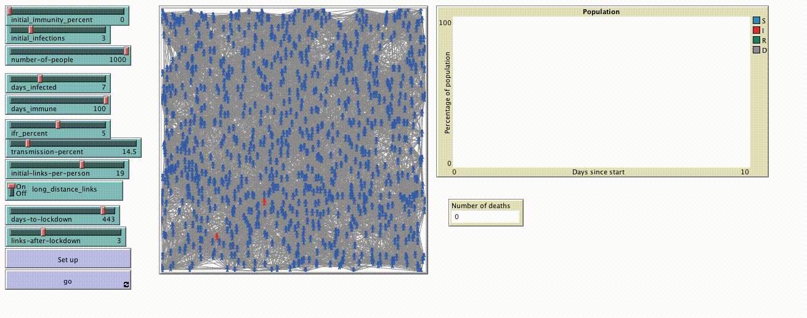
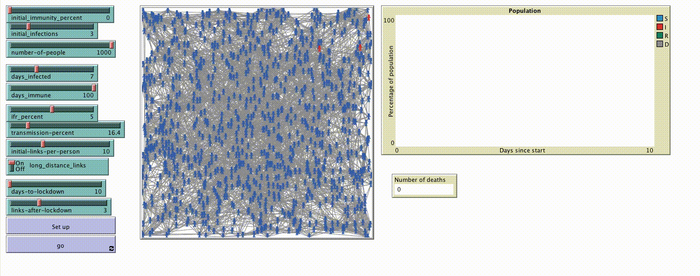
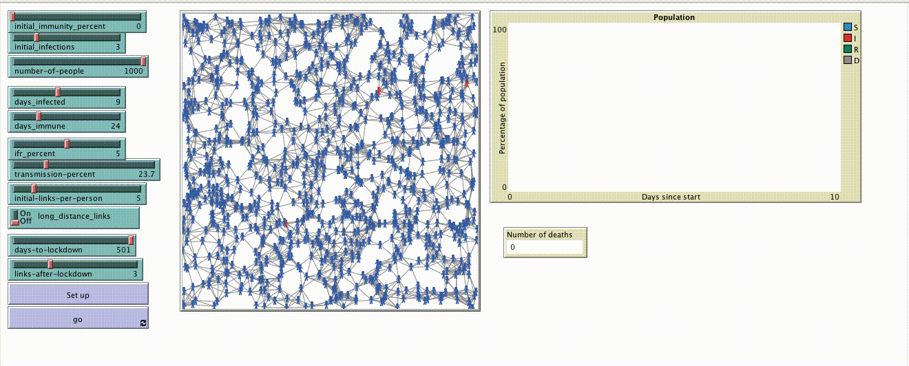
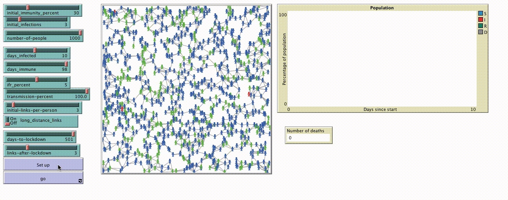

```{r setup, include=FALSE}
knitr::opts_chunk$set(echo = FALSE)
```

# Models {.tabset}

## Panmixia

```{r}

if(knitr::is_html_output()) {
  
}
```


## Moving wave

```{r}

if(knitr::is_html_output()) {
  
}
```

## Lockdown

```{r}

if(knitr::is_html_output()) {
  
}
```


## Fast waning immunity

```{r}

if(knitr::is_html_output()) {
  
}
```


## Blocking immunity

```{r}

if(knitr::is_html_output()) {
  
}
```


